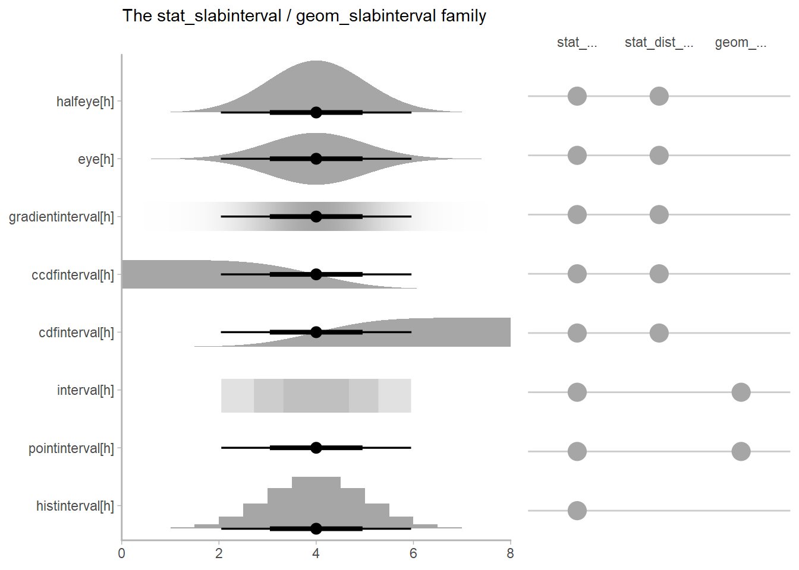

```{r chunk_options, include=FALSE}
knitr::opts_chunk$set(
  fig.path = "man/figures/README/"
)
if (capabilities("cairo")) {
  knitr::opts_chunk$set(
    dev.args = list(png = list(type = "cairo"))
  )
}
```

# ggdist: Visualizations of distributions and uncertainty

[](https://github.com/mjskay/ggdist/actions)
[](https://codecov.io/github/mjskay/ggdist?branch=master)
[](https://cran.r-project.org/package=ggdist)

[](https://doi.org/10.5281/zenodo.3879620)


[ggdist](https://mjskay.github.io/ggdist/) is an R package that provides a flexible set of `ggplot2` geoms and stats designed
especially for visualizing distributions and uncertainty. It is designed for both
frequentist and Bayesian uncertainty visualization, taking the view that uncertainty
visualization can be unified through the perspective of distribution visualization:
for frequentist models, one visualizes confidence distributions or bootstrap distributions (see `vignette("freq-uncertainty-vis")`);
for Bayesian models, one visualizes probability distributions (see the [tidybayes](https://mjskay.github.io/tidybayes/) 
package, which builds on top of `ggdist`).

The `geom_slabinterval()` / `stat_slabinterval()` family (see `vignette("slabinterval")`) makes it
easy to visualize point summaries and intervals, eye plots, half-eye plots, ridge plots,
CCDF bar plots, gradient plots, histograms, and more:



The `geom_dotsinterval()` / `stat_dotsinterval()` family (see `vignette("dotsinterval")`) makes
it easy to visualize dot+interval plots, Wilkinson dotplots, beeswarm plots, and quantile dotplots
(and combined with half-eyes, composite plots like rain cloud plots):

```{r halfeye_dotplot, echo=FALSE, message=FALSE, warning=FALSE}
library(ggplot2)
library(dplyr)
library(ggdist)

set.seed(12345) # for reproducibility

data.frame(
  abc = c("a", "b", "c"),
  value = rnorm(300, c(1, 8, 3), c(1, 1.7, 1))
) %>%
  ggplot(aes(y = abc, x = value, fill = abc)) +
  stat_slab() +
  stat_dotsinterval(side = "bottom", slab_color = NA) +
  scale_fill_brewer(palette = "Set2") +
  theme_ggdist()
```

The `geom_lineribbon()` / `stat_lineribbon()` family (see `vignette("lineribbon")`) makes it easy to visualize 
fit lines with an arbitrary number of uncertainty bands:
  
```{r lineribbon, echo=FALSE, message=FALSE, warning=FALSE}
library(ggplot2)
library(dplyr)
library(tidyr)
library(ggdist)
library(broom)

m_mpg = lm(mpg ~ hp * cyl, data = mtcars)
mtcars %>%
  group_by(cyl) %>%
  expand(hp = seq(min(hp), max(hp), length.out = 101)) %>%
  augment(m_mpg, newdata = ., se_fit = TRUE) %>%
  ggplot(aes(x = hp, fill = ordered(cyl), color = ordered(cyl))) +
  stat_lineribbon(
    aes(dist = "norm", arg1 = .fitted, arg2 = .se.fit), 
    alpha = 1/4
  ) +
  geom_point(aes(y = mpg), data = mtcars) +
  
  scale_fill_brewer(palette = "Set2") +
  scale_color_brewer(palette = "Dark2") +
  labs(
    color = "cyl",
    fill = "cyl",
    y = "mpg"
  ) +
  theme_ggdist()
```

All stat in `ggdist` also support visualizing analytical distributions and vectorized distribution
data types like [distributional](https://pkg.mitchelloharawild.com/distributional/) objects or `posterior::rvar()` 
objects. This is particularly useful when visualizing uncertainty in frequentist
models (see `vignette("freq-uncertainty-vis")`) or when visualizing priors in a
Bayesian analysis.

The `ggdist` geoms and stats also form a core part of the [tidybayes](https://mjskay.github.io/tidybayes/) package (in fact,
they originally were part of `tidybayes`). For examples of the use of `ggdist` geoms and
stats for visualizing uncertainty in Bayesian models, see the vignettes in tidybayes, such as
`vignette("tidybayes", package = "tidybayes")` or `vignette("tidy-brms", package = "tidybayes")`.

## Cheat sheets

<a href="https://github.com/mjskay/ggdist/blob/master/figures-source/cheat_sheet-slabinterval.pdf"></a>  

## Installation

You can install the currently-released version from CRAN with this R
command:

```{r install, eval=FALSE}
install.packages("ggdist")
```

Alternatively, you can install the latest development version from GitHub with these R
commands:

```{r install_github, eval=FALSE}
install.packages("devtools")
devtools::install_github("mjskay/ggdist")
```

## Feedback, issues, and contributions

I welcome feedback, suggestions, issues, and contributions! Contact me at <mjskay@northwestern.edu>. If you have found a bug, please file it [here](https://github.com/mjskay/ggdist/issues/new) with minimal code to reproduce the issue. Pull requests should be filed against the [`dev`](https://github.com/mjskay/ggdist/tree/dev) branch.


## Citing `ggdist`

Matthew Kay (`r format(Sys.Date(), "%Y")`). _ggdist: Visualizations of Distributions and Uncertainty_. R package version `r getNamespaceVersion("ggdist")`, <https://mjskay.github.io/ggdist/>. DOI: [10.5281/zenodo.3879620](https://doi.org/10.5281/zenodo.3879620).
