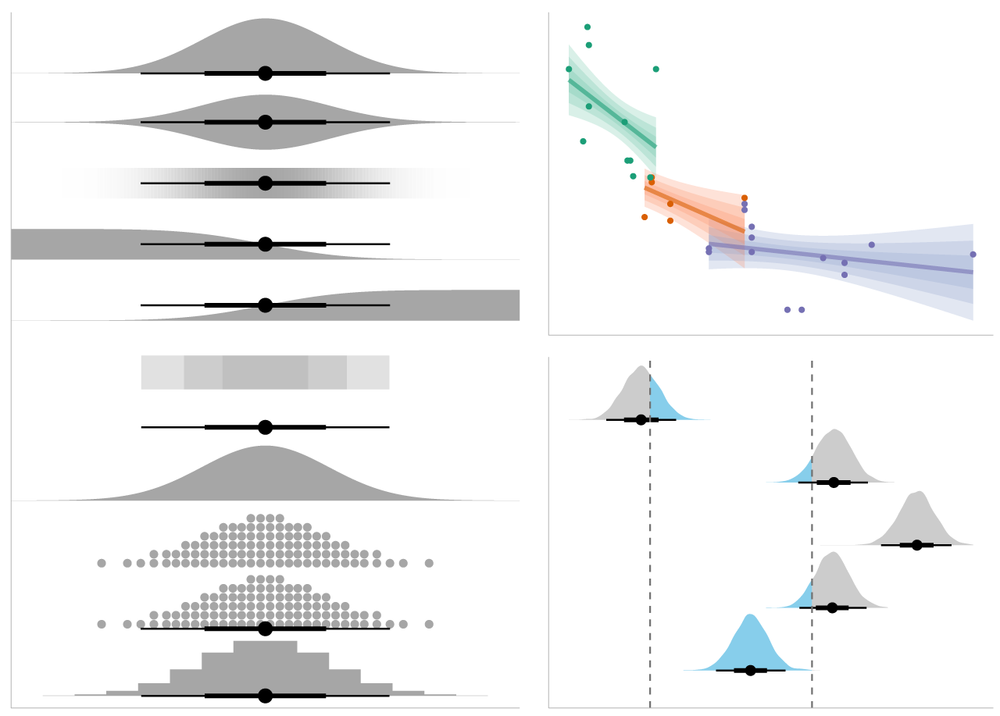

# tidybayes: Bayesian analysis + tidy data + geoms 

[](https://travis-ci.org/mjskay/tidybayes)
[](https://codecov.io/github/mjskay/tidybayes?branch=master)
[](https://cran.r-project.org/package=tidybayes)
[](https://zenodo.org/badge/latestdoi/33396684)



`tidybayes` is an R package that aims to make it easy to integrate popular Bayesian 
modeling methods into a tidy data + ggplot workflow.

[Tidy](http://cran.r-project.org/web/packages/tidyr/vignettes/tidy-data.html)
data frames (one observation per row) are particularly convenient for use
in a variety of R data manipulation and visualization packages. However,
when using Bayesian modeling functions like JAGS or Stan in R, we often have
to translate this data into a form the model understands, and then after
running the model, translate the resulting sample (or predictions) into a more tidy
format for use with other R functions.  `tidybayes` aims to simplify these 
two common (often tedious) operations:

* __Composing data__ for use with the model. This often means translating
  data from a `data.frame` into a `list` , making sure `factors` are encoded as
  numerical data, adding variables to store the length of indices, etc. This
  package helps automate these operations using the `compose_data` function, which
  automatically handles data types like `numeric`, `logical`, `factor`, and `ordinal`, 
  and allows easy extensions for converting other datatypes into a format the
  model understands by providing your own implementation of the generic `as_data_list`.

* __Extracting tidy draws__ from the model. This often means extracting indices
  from parameters with names like `"b[1,1]"`, `"b[1,2]"` into separate columns
  of a data frame, like `i = c(1,1,..)` and `j = c(1,2,...)`. More tediously,
  sometimes these indices actually correspond to levels of a factor in the original
  data; e.g. `"x[1]"` might correspond to a value of `x` for the first level of
  some factor. We provide several straightforward ways to convert draws from a
  variable with indices into useful long-format 
  ("[tidy](http://cran.r-project.org/web/packages/tidyr/vignettes/tidy-data.html)") 
  data frames, with automatic back-conversion of common data types (factors, logicals)
  using the `spread_draws` and `gather_draws` functions, including automatic 
  recovery of factor levels corresponding to variable indices. In most cases this
  kind of long-format data is much easier to use with other data-manipulation and 
  plotting packages (e.g., `dplyr`, `tidyr`, `ggplot2`) than the format provided 
  by default from the model.
  
`tidybayes` also provides some additional functionality for data manipulation
and visualization tasks common to many models:

* __Extracting tidy fits and predictions__ from models. For models like those
  provided by `rstanarm` and `brms`, `tidybayes` provides a tidy analog of the
  `fitted` and `predict` functions, called `add_fitted_draws` and 
  `add_predicted_draws`. These functions are modeled after the `modelr::add_predictions`
  function, and turn a grid of predictions into a long-format data frame of
  draws from either the fits or predictions from a model. These functions make
  it straightforward to generate arbitrary fit lines from a model.
  
* __Summarizing posterior distributions__ from models. The `point_interval`
  family of functions (`median_qi`, `mean_qi`, `mode_hdi`, etc) are methods 
  for generating point summaries and intervals that are designed with tidy workflows 
  in mind. They can generate point summaries plus an arbitrary number of probability 
  intervals *from* tidy data frames of draws, they *return* tidy data frames,
  and they **respect data frame groups**.

* __Visualizing posteriors__. The focus on tidy data makes the output from tidybayes
  easy to visualize using `ggplot`. Existing `geom`s (like `geom_pointrange` and 
  `geom_linerange`) can give useful output, but `tidybayes` also includes several
  geoms to simplify common combinations of `stats` and `geoms` with sensible
  defaults suitable for visualizing posterior point summaries and intervals (`geom_pointinterval`,
  `geom_pointintervalh`, `stat_pointinterval`, `stat_pointintervalh`), visualizing
  densities with point summaries and intervals ("eye plots", `geom_eye` and `geom_eyeh`;
  or "half-eye plots", `geom_halfeyeh`), and visualizing fit lines with an arbitrary 
  number of uncertainty bands (`geom_lineribbon` and `stat_lineribbon`). Combining the
  base-R `quantile` function with `geom_dotplot` also facilitates the contruction
  of quantile dotplots of posteriors (see example in this document).

* __Comparing a variable across levels of a factor__, which often means first
  generating pairs of levels of a factor (according to some desired set of 
  comparisons) and then computing a function over the value of the comparison
  variable for those pairs of levels. Assuming your data is in the format
  returned by `spread_draws`, the `compare_levels` function allows comparison
  across levels to be made easily.

Finally, `tidybayes` aims to fit into common workflows through __compatibility with
other packages__:

* Drop-in functions to translate tidy column names used by `tidybayes` to/from names used
  by other common packages and functions, including column names used by
  `ggmcmc::ggs` (via `to_ggmcmc_names` and `from_ggmcmc_names`) and column names used by
  `broom::tidy` (via `to_broom_names` and `from_broom_names`), which makes comparison
  with results of other models straightforward.
  
* The `unspread_draws` and `ungather_draws` functions invert
  `spread_draws` and `gather_draws`, aiding compatiblity with other Bayesian
  plotting packages (notably `bayesplot`).
  
* The `gather_emmeans_draws` function turns the output from `emmeans::emmeans`
  (formerly `lsmeans`) into long-format data frames (when applied to supported
  model types, like `MCMCglmm` and `rstanarm` models).

  

## Supported model types

`tidybayes` aims to support a variety of models with a uniform interface. Currently supported models include 
[rstan](https://cran.r-project.org/package=rstan),
[brms](https://cran.r-project.org/package=brms), 
[rstanarm](https://cran.r-project.org/package=rstanarm), 
[runjags](https://cran.r-project.org/package=runjags),
[rjags](https://cran.r-project.org/package=rjags), 
[jagsUI](https://cran.r-project.org/package=jagsUI), 
[coda::mcmc and coda::mcmc.list](https://cran.r-project.org/package=coda),
[MCMCglmm](https://cran.r-project.org/package=MCMCglmm), 
and anything with its own `as.mcmc.list` implementation. If you install the [tidybayes.rethinking](https://github.com/mjskay/tidybayes.rethinking) package, models from the [rethinking](https://github.com/rmcelreath/rethinking) package are also supported.


## Installation

You can install the latest development version from GitHub with these R
commands:

```{r, eval=FALSE}
install.packages("devtools")
devtools::install_github("mjskay/tidybayes")
```

## Examples

This example shows the use of tidybayes with the Stan modeling language; however, tidybayes supports many other model types, such as JAGS, brm, rstanarm, and (theoretically) any model type supported by `coda::as.mcmc.list`.

```{r setup, message = FALSE, warning = FALSE}
library(magrittr)
library(dplyr)
library(ggplot2)
library(ggstance)
library(rstan)
library(tidybayes)
library(emmeans)
library(broom)
library(brms)
library(modelr)
library(forcats)
```

```{r hidden_options, include=FALSE}
rstan_options(auto_write = TRUE)
options(mc.cores = parallel::detectCores())

#ggplot options
theme_set(theme_light())

#misc options
options(width = 90)
```

Imagine this dataset:

```{r}
set.seed(5)
n = 10
n_condition = 5
ABC =
  data_frame(
    condition = rep(c("A","B","C","D","E"), n),
    response = rnorm(n * 5, c(0,1,2,1,-1), 0.5)
  )

ABC %>%
  ggplot(aes(x = response, y = condition)) +
  geom_point(alpha = 0.5) +
  ylab("condition")
```

A hierarchical model of this data might fit an overall mean across the conditions (`overall_mean`), the standard deviation of the condition means (`condition_mean_sd`), the mean within each condition (`condition_mean[condition]`) and the standard deviation of the responses given a condition mean (`response_sd`):

```{stan, output.var = "ABC_stan", results = "hide"}
data {
  int<lower=1> n;
  int<lower=1> n_condition;
  int<lower=1, upper=n_condition> condition[n];
  real response[n];
}
parameters {
  real overall_mean;
  vector[n_condition] condition_zoffset;
  real<lower=0> response_sd;
  real<lower=0> condition_mean_sd;
}
transformed parameters {
  vector[n_condition] condition_mean;
  condition_mean = overall_mean + condition_zoffset * condition_mean_sd;
}
model {
  response_sd ~ cauchy(0, 1);         // => half-cauchy(0, 1)
  condition_mean_sd ~ cauchy(0, 1);   // => half-cauchy(0, 1)
  overall_mean ~ normal(0, 5);
  condition_zoffset ~ normal(0, 1);   // => condition_mean ~ normal(overall_mean, condition_mean_sd)
  for (i in 1:n) {
    response[i] ~ normal(condition_mean[condition[i]], response_sd);
  }
}
```

### Composing data for input to model: `compose_data`

We have compiled and loaded this model into the variable `ABC_stan`. Rather than munge the data into a format Stan likes ourselves, we will use the `tidybayes::compose_data` function, which takes our `ABC` data frame and automatically generates a list of the following elements:

* `n`: number of observations in the data frame
* `n_condition`: number of levels of the condition factor
* `condition`: a vector of integers indicating the condition of each observation
* `response`: a vector of observations

So we can skip right to modeling:

```{r}
m = sampling(ABC_stan, data = compose_data(ABC), control = list(adapt_delta=0.99))
```

### Getting tidy draws from the model: `spread_draws`

We decorate the fitted model using `tidybayes::recover_types`, which will ensure that numeric indices (like `condition`) are back-translated back into factors when we extract data:

```{r}
m %<>% recover_types(ABC)
```

Now we can extract variables of interest using `spread_draws`, which automatically parses indices, converts them back into their original format, and turns them into data frame columns. This function accepts a symbolic specification of Stan variables using the same syntax you would to index columns in Stan. For example, we can extract the condition means and the residual standard deviation:

```{r}
m %>%
  spread_draws(condition_mean[condition], response_sd) %>%
  head(15)  # just show the first few rows
```

The condition numbers are automatically turned back into text ("A", "B", "C", ...) and split into their own column. A long-format data frame is returned with a row for every draw $\times$ every combination of indices across all variables given to `spread_draws`; for example, because `response_sd` here is not indexed by `condition`, within the same draw it has the same value for each row corresponding to a different `condition` (some other formats supported by `tidybayes` are discussed in `vignette("tidybayes")`; in particular, the format returned by `gather_draws`).


### Plotting posteriors as eye plots: `geom_eye` / `geom_eyeh`

Automatic splitting of indices into columns makes it easy to plot the condition means here. We will employ the `tidybayes::geom_eyeh` geom (horizontal version of `tidybayes::geom_eye`), which combines a violin plot of the posterior density, median, 66% and 95% quantile interval to give an "eye plot" of the posterior. The point and interval types are customizable using the `point_interval` family of functions. A "half-eye" plot (non-mirrored density) is also available as `tidybayes::geom_halfeyeh`.

```{r}
m %>%
  spread_draws(condition_mean[condition]) %>%
  ggplot(aes(x = condition_mean, y = condition)) +
  geom_eyeh()
```

Or one can employ the similar "half-eye" plot:

```{r}
m %>%
  spread_draws(condition_mean[condition]) %>%
  ggplot(aes(x = condition_mean, y = condition)) +
  geom_halfeyeh()
```

### Plotting posteriors as quantile dotplots

Intervals are nice if the alpha level happens to line up with whatever decision you are trying to make, but getting a shape of the posterior is better (hence eye plots, above). On the other hand, making inferences from density plots is imprecise (estimating the area of one shape as a proportion of another is a hard perceptual task). Reasoning about probability in frequency formats is easier, motivating [quantile dotplots](https://github.com/mjskay/when-ish-is-my-bus/blob/master/quantile-dotplots.md), which also allow precise estimation of arbitrary intervals (down to the dot resolution of the plot, here 100):

```{r}
m %>%
  spread_draws(condition_mean[condition]) %>%
  do(data_frame(condition_mean = quantile(.$condition_mean, ppoints(100)))) %>%
  ggplot(aes(x = condition_mean)) +
  geom_dotplot(binwidth = .04) +
  facet_grid(fct_rev(condition) ~ .) +
  scale_y_continuous(breaks = NULL)
```

The idea is to get away from thinking about the posterior as indicating one canonical point or interval, but instead to represent it as (say) 100 approximately equally likely points.

### Point and interval summaries

The functions `tidybayes::median_qi`, `tidybayes::mean_qi`, `tidybayes::mode_hdi`, etc (the `point_interval` functions) give tidy output of point summaries and intervals:

```{r}
m %>%
  spread_draws(condition_mean[condition]) %>%
  median_qi(condition_mean)
```


### Comparison to other models via compatibility with `broom`

Translation functions like `tidybayes::to_broom_names`, `tidybayes::from_broom_names`, `tidybayes::to_ggmcmc_names`, etc. can be used to translate between common tidy format data frames with different naming schemes. This makes it easy, for example, to compare points summaries and intervals between `tidybayes` output and models that are supported by `broom::tidy`.

For example, let's compare against ordinary least squares (OLS) regression:

```{r}
linear_results = 
  lm(response ~ condition, data = ABC) %>% 
  emmeans(~ condition) %>% 
  tidy() %>%
  mutate(model = "OLS")
linear_results
```

Using `tidybayes::to_broom_names`, we'll convert the output from `median_qi` (which uses names `.lower` and `.upper`) to use names from `broom` (`conf.low` and `conf.high`) so that comparison with output from `broom::tidy` is easy:

```{r}
bayes_results = m %>%
  spread_draws(condition_mean[condition]) %>%
  median_qi(estimate = condition_mean) %>%
  to_broom_names() %>%
  mutate(model = "Bayes")
bayes_results
```

This makes it easy to bind the two results together and plot them:

```{r}
bind_rows(linear_results, bayes_results) %>%
  ggplot(aes(y = condition, x = estimate, xmin = conf.low, xmax = conf.high, color = model)) +
  geom_pointrangeh(position = position_dodgev(height = .3))
```

Shrinkage towards the overall mean is visible in the Bayesian results.

Comptability with `broom::tidy` also gives compatibility with `dotwhisker::dwplot`:

```{r, warning = FALSE}
bind_rows(linear_results, bayes_results) %>%
  rename(term = condition) %>%
  dotwhisker::dwplot()
```

### Posterior prediction and complex custom plots

The tidy data format returned by `spread_draws` also facilitates additional computation on variables followed by the construction of more complex custom plots. For example, we can generate posterior predictions easily, and use the `.width` argument (passed internally to `median_qi`) to generate any number of intervals from the posterior predictions, then plot them alongside point summaries and the data:

```{r}
m %>%
  spread_draws(condition_mean[condition], response_sd) %>%
  mutate(prediction = rnorm(n(), condition_mean, response_sd)) %>%
  ggplot(aes(y = condition)) +
  
  # posterior predictive intervals
  stat_intervalh(aes(x = prediction), .width = c(.5, .8, .95)) +
  scale_color_brewer() +
  
  # median and quantile intervals of condition mean
  stat_pointintervalh(aes(x = condition_mean), .width = c(.66, .95), position = position_nudge(y = -0.2)) +
  
  # data
  geom_point(aes(x = response), data = ABC)
```

This plot shows 66% and 95% quantile credible intervals of posterior median for each condition (point + black line); 95%, 80%, and 50% posterior predictive intervals (blue); and the data.


### Fit curves

For models that support it (like `rstanarm` and `brms` models), We can also use the `add_fitted_draws` or `add_predicted_draws` functions to generate posterior fits or predictions. Combined with the functions from the `modelr` package, this makes it easy to generate fit curves.

Let's fit a slightly naive model to miles per gallon versus horsepower in the `mtcars` dataset:

```{r, results = "hide", message = FALSE, warning = FALSE}
m_mpg = brm(mpg ~ log(hp), data = mtcars, family = lognormal)
```

Now we will use `modelr::data_grid`, `tidybayes::add_predicted_draws`, and `tidybayes::stat_lineribbon` to generate a fit curve with multiple probability bands:

```{r}
mtcars %>%
  data_grid(hp = seq_range(hp, n = 101)) %>%
  add_predicted_draws(m_mpg) %>%
  ggplot(aes(x = hp)) +
  stat_lineribbon(aes(y = .prediction), .width = c(.99, .95, .8, .5)) +
  geom_point(aes(y = mpg), data = mtcars) +
  scale_fill_brewer()
```

`stat_lineribbon(aes(y = .prediction), .width = c(.99, .95, .8, .5))` is one of several shortcut geoms that simplify common combinations of `tidybayes` functions and `ggplot` goems. It is roughly equivalent to the following:

```{r, eval=FALSE}
  stat_summary(
    aes(y = .prediction, fill = forcats::fct_rev(ordered(...width..)), group = -...width..), 
    geom = "ribbon", point_interval = median_qi, fun.args = list(.width = c(.99, .95, .8, .5))
  ) +
  stat_summary(aes(y = .prediction), fun.y = median, geom = "line", color = "red", size = 1.25)
```

Because this is all tidy data, if you wanted to build a model with interactions among different categorical variables (say a different curve for automatic and manual transmissions), you can easily generate predictions faceted over that variable (say, different curves for different transmission types). Then you could use the existing faceting features built in to ggplot to plot them.

Such a model might be:

```{r, results = "hide", message = FALSE, warning = FALSE}
m_mpg_am = brm(mpg ~ log(hp)*am, data = mtcars, family = lognormal)
```

Then we can generate and plot predictions as before (differences from above are highlighted as comments):

```{r}
mtcars %>%
  data_grid(hp = seq_range(hp, n = 101), am) %>%    # add am to the prediction grid
  add_predicted_draws(m_mpg_am) %>%
  ggplot(aes(x = hp, y = mpg)) +
  stat_lineribbon(aes(y = .prediction), .width = c(.99, .95, .8, .5)) +
  geom_point(data = mtcars) +
  scale_fill_brewer() +
  facet_wrap(~ am)                                  # facet by am
```

Or, if you would like overplotted posterior fit lines, you can instead use `tidybayes::add_fitted_draws` to get draws from fit lines (instead of predictions), select some reasonable number of them (say `n = 100`), and then plot them:

```{r}
mtcars %>%
  data_grid(hp = seq_range(hp, n = 101), am) %>%
  add_fitted_draws(m_mpg_am, n = 100) %>%         # sample 100 fits from the posterior
  ggplot(aes(x = hp, y = mpg)) +
  geom_line(aes(y = .value, group = .draw), alpha = 0.2, color = "red") +
  geom_point(data = mtcars) +
  facet_wrap(~ am)
```


See `vignette("tidybayes")` for a variety of additional examples and more explanation of how it works.


## Feedback, issues, and contributions

I welcome feedback, suggestions, issues, and contributions! Contact me at <mjskay@umich.edu>. If you have found a bug, please file it [here](https://github.com/mjskay/tidybayes/issues/new) with minimal code to reproduce the issue. Pull requests should be filed against the [dev](https://github.com/mjskay/tidybayes/tree/dev) branch.

`tidybayes` grew out of helper functions I wrote to make my own analysis pipelines tidier. Over time it has expanded to cover more use cases I have encountered, but I would love to make it cover more!

## Citing `tidybayes`

Matthew Kay (`r format(Sys.Date(), "%Y")`). _tidybayes: Tidy Data and Geoms for Bayesian Models_. R package version `r getNamespaceVersion("tidybayes")`, <https://mjskay.github.io/tidybayes/>.
DOI: [10.5281/zenodo.1308151](https://doi.org/10.5281/zenodo.1308151).
