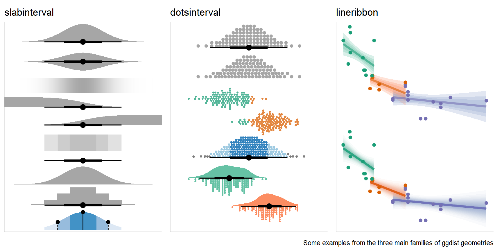
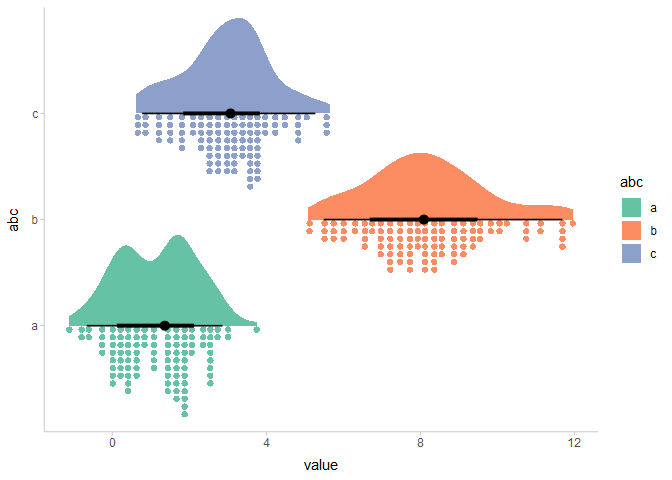

# ggdist: Visualizations of distributions and uncertainty

<!-- badges: start -->

[](https://github.com/mjskay/ggdist/actions/workflows/R-CMD-check.yaml)
[](https://app.codecov.io/github/mjskay/ggdist?branch=master)
[](https://cran.r-project.org/package=ggdist)
 [](https://doi.org/10.1109/TVCG.2023.3327195)
[](https://doi.org/10.5281/zenodo.3879620)
<!-- badges: end -->



[ggdist](https://mjskay.github.io/ggdist/) is an R package that provides
a flexible set of `{ggplot2}` geoms and stats designed especially for
visualizing distributions and uncertainty. It is designed for both
frequentist and Bayesian uncertainty visualization, taking the view that
uncertainty visualization can be unified through the perspective of
distribution visualization: for frequentist models, one visualizes
confidence distributions or bootstrap distributions (see
`vignette("freq-uncertainty-vis")`); for Bayesian models, one visualizes
probability distributions (see the
[tidybayes](https://mjskay.github.io/tidybayes/) package, which builds
on top of `{ggdist}`).

The `geom_slabinterval()` / `stat_slabinterval()` family (see
`vignette("slabinterval")`) makes it easy to visualize point summaries
and intervals, eye plots, half-eye plots, ridge plots, CCDF bar plots,
gradient plots, histograms, and more:


The `geom_dotsinterval()` / `stat_dotsinterval()` family (see
`vignette("dotsinterval")`) makes it easy to visualize dot+interval
plots, Wilkinson dotplots, beeswarm plots, and quantile dotplots (and
combined with half-eyes, composite plots like rain cloud plots):



The `geom_lineribbon()` / `stat_lineribbon()` family (see
`vignette("lineribbon")`) makes it easy to visualize fit lines with an
arbitrary number of uncertainty bands:


All stats in `{ggdist}` also support visualizing analytical
distributions and vectorized distribution data types like
[distributional](https://pkg.mitchelloharawild.com/distributional/)
objects or `posterior::rvar()` objects. This is particularly useful when
visualizing uncertainty in frequentist models (see
`vignette("freq-uncertainty-vis")`) or when visualizing priors in a
Bayesian analysis.

The `{ggdist}` geoms and stats also form a core part of the
[tidybayes](https://mjskay.github.io/tidybayes/) package (in fact, they
originally were part of `{tidybayes}`). For examples of the use of
`{ggdist}` geoms and stats for visualizing uncertainty in Bayesian
models, see the vignettes in `{tidybayes}`, such as
`vignette("tidybayes", package = "tidybayes")` or
`vignette("tidy-brms", package = "tidybayes")`.

## Cheat sheets

These cheat sheets focus on the `slabinterval` family of geometries:

<a href="https://github.com/mjskay/ggdist/blob/master/figures-source/cheat_sheet-slabinterval.pdf"></a>

## Installation

You can install the currently-released version from CRAN with this R
command:

``` r
install.packages("ggdist")
```

Alternatively, you can install the latest development version from
GitHub with these R commands:

``` r
install.packages("devtools")
devtools::install_github("mjskay/ggdist")
```

## Dependencies

`{ggdist}` aims to have minimal additional dependencies beyond those
already required by `{ggplot2}`. The `{ggdist}` dependencies fall into
the following categories:

1.  `{ggplot2}`.

2.  Packages that `{ggplot2}` also depends on. These packages add no
    additional dependency cost because `{ggplot2}` already requires
    them: `{rlang}`, `{cli}`, `{scales}`, `{tibble}`, `{vctrs}`,
    `{withr}`, `{gtable}`, and `{glue}`.

3.  Packages that `{ggplot2}` does not depend on. These are all
    well-maintained packages with few dependencies and a clear need
    within `{ggdist}`:

    - `{distributional}`: this implementation of distribution vectors
      powers much of `{ggdist}`. This package adds minimal additional
      cost, as its only dependency that is not also a dependency of
      `{ggplot2}` is `{numDeriv}`, which is needed by `{ggdist}` anyway
      (see below).
    - `{numDeriv}`: used for calculating Jacobians of scale
      transformations. Needed because testing has revealed common
      situations where `stats::numericDeriv()` fails but `{numDeriv}`
      does not. Widely used by other CRAN packages and has no additional
      dependencies.
    - `{quadprog}`: Used to solve constrained optimization problems
      during different parts of dotplot layout, particularly to avoid
      dot overlaps in the `"bin"` and `"weave"` layouts. Widely used by
      other CRAN packages and has no additional dependencies.
    - `{Rcpp}`: Used to implement faster dotplot layout. Widely used by
      other CRAN packages and has no additional dependencies.

## Feedback, issues, and contributions

I welcome feedback, suggestions, issues, and contributions! If you have
found a bug, please file it
[here](https://github.com/mjskay/ggdist/issues/new) with minimal code to
reproduce the issue. Pull requests should be filed against the
[`dev`](https://github.com/mjskay/ggdist/tree/dev) branch. I am not
particularly reliable over email, though you can try to contact me at
<mjskay@northwestern.edu>. A [Twitter](https://twitter.com/mjskay) DM is
more likely to elicit a response.

## Citing `ggdist`

Matthew Kay (2024). ggdist: Visualizations of Distributions and
Uncertainty in the Grammar of Graphics. *IEEE Transactions on
Visualization and Computer Graphics*, 30(1), 414–424. DOI:
[10.1109/TVCG.2023.3327195](https://doi.org/10.1109/TVCG.2023.3327195).

Matthew Kay (2024). ggdist: Visualizations of Distributions and
Uncertainty. R package version 3.3.2,
<https://mjskay.github.io/ggdist/>. DOI:
[10.5281/zenodo.3879620](https://doi.org/10.5281/zenodo.3879620).
