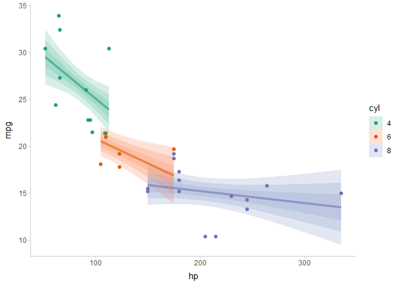

# ggdist: Visualizations of distributions and uncertainty

[](https://github.com/mjskay/ggdist/actions)
[](https://codecov.io/github/mjskay/ggdist?branch=master)
[](https://cran.r-project.org/package=ggdist)

[](https://doi.org/10.5281/zenodo.3879620)


[ggdist](https://mjskay.github.io/ggdist/) is an R package that provides
a flexible set of `ggplot2` geoms and stats designed especially for
visualizing distributions and uncertainty. It is designed for both
frequentist and Bayesian uncertainty visualization, taking the view that
uncertainty visualization can be unified through the perspective of
distribution visualization: for frequentist models, one visualizes
confidence distributions or bootstrap distributions (see
`vignette("freq-uncertainty-vis")`); for Bayesian models, one visualizes
probability distributions (see the
[tidybayes](https://mjskay.github.io/tidybayes/) package, which builds
on top of `ggdist`).

The `geom_slabinterval()` / `stat_slabinterval()` /
`stat_dist_slabinterval()` family (see `vignette("slabinterval")`)
includes point summaries and intervals, eye plots, half-eye plots, CCDF
bar plots, gradient plots, dotplots, and histograms:


The `geom_lineribbon()` / `stat_lineribbon()` / `stat_dist_lineribbon()`
family (see `vignette("lineribbon")`) makes it easy to visualize fit
lines with an arbitrary number of uncertainty bands:

<!-- -->

All geoms in `ggdist` also have `stat_dist_` counterparts designed for
visualizing analytical distributions, which is particularly useful when
visualizing uncertainty in frequentist models (see
`vignette("freq-uncertainty-vis")`) or when visualizing priors in a
Bayesian analysis.

The `ggdist` geoms and stats also form a core part of the
[tidybayes](https://mjskay.github.io/tidybayes/) package (in fact, they
originally were part of `tidybayes`). For examples of the use of
`ggdist` geoms and stats for visualizing uncertainty in Bayesian models,
see the vignettes in tidybayes, such as
`vignette("tidybayes", package = "tidybayes")` or
`vignette("tidy-brms", package = "tidybayes")`.

## Cheat sheets

<a href="https://github.com/mjskay/ggdist/blob/master/figures-source/cheat_sheet-slabinterval.pdf"></a>

## Installation

You can install the currently-released version from CRAN with this R
command:

``` r
install.packages("ggdist")
```

Alternatively, you can install the latest development version from
GitHub with these R commands:

``` r
install.packages("devtools")
devtools::install_github("mjskay/ggdist")
```

## Feedback, issues, and contributions

I welcome feedback, suggestions, issues, and contributions! Contact me
at <mjskay@northwestern.edu>. If you have found a bug, please file it
[here](https://github.com/mjskay/ggdist/issues/new) with minimal code to
reproduce the issue. Pull requests should be filed against the
[`dev`](https://github.com/mjskay/ggdist/tree/dev) branch.

## Citing `ggdist`

Matthew Kay (2020). *ggdist: Visualizations of Distributions and
Uncertainty*. R package version 2.4.0,
<https://mjskay.github.io/ggdist/>. DOI:
[10.5281/zenodo.3879620](https://doi.org/10.5281/zenodo.3879620).
